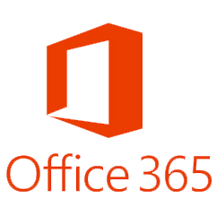

</img>
Methos groeit en zet zich in bij klanten waar de vraag of noodzaak voor automatisering aanwezig is. Dit kan het automatiseren van IT beheer taken zijn, maar ook migraties naar een cloud platform zoals Azure of Office3 65.interessante en complexe IT-omgevingen waarbij Microsoft Azure en Office 365 een belangrijke rol innemen. Wij transformeren bedrijven naar de public cloud Azure. Ter versterking van ons team zoeken wij een Azure Engineer.

Wij stellen onze klanten in staat om met de nieuwste, maar soms ook met oude, technologie competitief te zijn, en te blijven! Hoe we dit doen? Door slim en efficient te werken en om te gaan met (cloud) resources en deze met een no-nonsense mentaliteit en Agile methodiek te implementeren.

1. We maken/bouwen iets kleins, en laten de klant het beoordelen:
    * Bevalt het niet? Jammer, maar dan sturen we toch gewoon bij aan de hand van de feedback?
    * Bevalt het? Top! Dan gaan we verder...
2. Ga verder bij 1.

Deze Agile methodiek maakt onderdeel uit van onze werkwijze die al onze medewerkers uitdragen. Vanuit je rol heb je frequent contact met meerdere rollen bij de klant, zoals een product owner, software architect, of natuurlijk andere engineers.
Kortom, een veelzijdige functie waarbij jij onderdeel bent van een dynamisch team.

## Wij zoeken?
Voor ons team zijn we op zoek naar een enthousiaste en passionele Azure Engineer die beschikt over de volgende skills:
* Je hebt HBO werk- en denkniveau (opleiding is gewenst, niet vereist);
* Je bent klantgericht, gedisciplineerd, nauwkeurig, proactief en beschikt over voldoende overtuigingskracht;
* Je hebt het vermogen om analytisch een uitdaging te benaderen;
* Je hebt een enthousiaste én integere persoonlijkheid;
* Je communicatieve vaardigheden zijn goed tot uitstekend;
* Je hebt een goede beheersing van de Nederlands en Engelse taal in woord en geschrift.
* Jij hebt ervaring met of bent bereid om in korte termijn ervaring op te doen in:
    * Eis (*minimaal 2 van toepassing*)
        * PowerShell
        * PowerShell Pester
        * PowerApps
        * Power Automate
        * Microsoft Flow
    * Wens (*minimaal 1 van toepassing*)
        * Continuous Integration, Continuous Deployment
        * GitHub / Azure DevOps (Server) / VSTS

## Wij bieden?
Wat bieden we je?
* Leuke collega’s binnen een groeiend bedrijf
* Een moderne opvatting qua werkethiek: veel vrijheid, maar met de bijbehorende verantwoordelijkheid
* Persoonlijk (ja, *persoonlijk*) hardwarebudget
* Persoonlijk (ja, *persoonlijk*) evenementen- en educatie budget
* Een rol binnen een enthousiaste no-nonsense organisatie waar technische expertise en persoonlijke groei belangrijk zijn
* Mobiliteitsbudget
* Een salaris met pensioensopbouw
* Goede secundaire arbeidsvoorwaarden
* Leuke extra’s en uitstapjes*
 en...
* Eigen initiatief wordt erg gewaardeerd en daar krijg je dan ook de ruimte voor!

Wij werken met het eat-your-own-dogfood principe: Doe wat je zegt en zeg wat je doet. 

## Kom er bij...
Is dit wat voor jou? Solliciteer dan direct en stuur je CV met motivatie naar [Jeff Wouters](mailto:jeff@methos.nl).