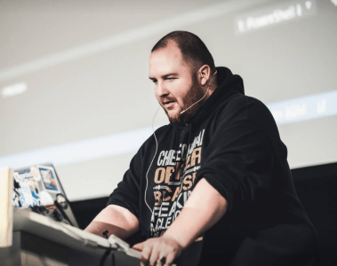

Jeff is de oprichter van ons clubje met een grote voorliefde voor PowerShell, en infrastructure-as-code in het algemeen. In de rol van CTO is hij zowel verantwoordelijk voor de technische (in)richting van Methos, als ondersteuning voor de commerciële activiteiten en recruitment.  
Toen hij als kleine jongen begon in de ICT was dat met een Commodore64 waarop hij zijn eerste 'Pacman' heeft geschreven. Ook stond hij namens een bedrijf uit Meppel samen met zijn vader door het hele land op computerbeurzen van InterExpo en PC Discount voor het verkoop van hardware. Later is hij samen met zijn vader en een 3e compagnon het PC Hardware TestTeam gestart, die op de computerbeurzen klanten de mogelijkheid gaf om hun net aangeschafte hardware te testen op (correcte) werking. Jeff was hierbij het 14-jarig jongetje wat onder andere met 19" CRT schermen sleepte.

In 2003 werd Windows XP uitgebracht en Jeff stond dat jaar op de HCC beurs. Niet als onderdeel van het PC Hardware TestTeam, maar met een CD die hij verkocht met hierop gratis en shareware software getest op Windows XP. Zijn volledige oplage van 15.000 stuks heeft hij in 3 dagen verkocht, en van de winst heeft hij zijn opleiding MBO ICT betaald. Door de jaren heen kwam hij telkens weer in aanraking met programmeer/script talen, zoals Batch, (Turbo) Pascal, Delphi, PHP en C#. Toch ging zijn voorliefde uit naar de Ops kan van ICT (Systeembeheer).

Na zijn MBO opleiding is Jeff gaan werken, en in de avond/weekend uren begonnen aan zijn studie HBO Technische Informatica. Na deze Master opleiding afgerond te hebben, is hij doorgegaan met een MBA in Business Management. In deze tijd is hij ook begonnen als ZZPer, met de intentie om dit later uit te bouwen naar een BV.
Toen hij qua opleiding de technische (informatica) en business (MBA) delen had afgerond, is hij begonnen aan een PhD in Toegepaste Psychologie. Dit helpt hem met het 3e deel waar een IT bedrijf mee te maken krijgt: mensen. Het moment dat het einde van die opleiding in zicht kwam, heeft hij de bedrijfsvorm van Methos omgezet naar een BV, en begon het zoeken naar collega’s/werknemers met dezelfde passie voor het automatiseren van IT die hij zelf heeft.

Jeff is een techneut in hart en nieren, maar is ook in staat om de business value te bepalen en voorop te stellen. Dit is één van de dingen die hem een goede consultant maakt, maar ook de reden waarom hij ondanks zijn leiderschapsrol binnen Methos graag naar klanten blijft gaan. Jeff vindt het leuk om 'aan de knoppen' te zitten en wilt dit in bepaalde mate altijd blijven doen.
