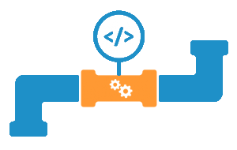

Worden builds en deployments handmatig of gescript uitgevoerd? Gaan builds en deployments regelmatig fout? Zijn de ontwikkelteams gestart met Agile werken, maar duurt het nog te lang om software naar productie uit te rollen? Herkent u dit? Dan valt er veel winst te behalen met het opzetten en inrichten van een geautomatiseerde en gecontroleerde build- en release-straat: een CI/CD pipeline.

## Continuous Integration en Continuous Delivery
CI staat voor Continuous Integration: het continu en automatisch integreren en testen van code aanpassingen. CD staat voor Continuous Delivery: het continu en automatisch opleveren van software aanpassingen naar test- en productie omgevingen.
Wij kunnen u helpen met het opzetten van een CI/CD pipeline op basis van Microsoft Azure DevOps of Azure DevOps Server. Dit kunnen we naar wens integreren met andere tools en applicaties, zodat de CI/CD pipeline optimaal is afgestemd op uw organisatie.

## Waarom een CI/CD Pipeline inrichten?
Dankzij een geautomatiseerde CI/CD pipeline kan software sneller en met een betere kwaliteit uitgerold worden. Code wordt sneller geïntegreerd, sneller getest en automatisch uitgerold naar test omgevingen. Hierdoor kunnen fouten sneller ontdekt en opgelost worden. Dit resulteert in betere kwaliteit code.

Productiereleases worden dankzij automatisering een routineklus. Doordat kleine releases snel beschikbaar gesteld worden, kunnen klanten ook snel reageren op nieuwe functionaliteit. Dit geeft de ontwikkelteams snel feedback en levert de klant meer waarde op.

## Wat is er nodig?
Om een CI/CD pipeline voor u te kunnen inrichten, dient u te beschikkken over een Azure DevOps account of een TFS/Azure DevOps Server omgeving. Inclusief de benodigde licenties. Voor YAML Pipelines is tevens een git repository nodig. Daarnaast is kennis van de applicaties beschikbaar binnen uw team; hoe wordt de applicatie gebuild en welke stappen zijn nodig voor een deployment. Uw ontwikkelteam maakt zelf unit tests en test scripts.

</img>

## Pipeline as Code
In Azure DevOps is het ook mogelijk om naast een ‘classic pipeline’, een pipeline op te zetten als code. Dit is ook wel ‘Pipeline as Code’ genoemd. Deze pipeline is opgebouwd met de YAML Ain’t Markup Language (YAML) taal.

De voordelen van Pipeline as Code zijn:

* Kan in versiebeheer geplaatst worden.
* Onverwachte veranderingen zijn niet mogelijk.
* Er kunnen audits op uitgevoerd worden.
* Door middel van peer reviews in pull requests kan de kwaliteit gewaarborgd worden.

</img>

## Wat levert een geautomatiseerde CI/CD pipeline u op?
Wij richten een geautomatiseerde CI/CD pipeline in binnen Azure DevOps of Azure DevOps Server. Hierna worden code aanpassingen automatisch gebuild en getest. Daarnaast worden deployments naar de gewenste omgevingen automatisch uitgevoerd.
Wilt u meer weten over de mogelijkheden om een CI/CD Pipeline in te richten? Neem dan contact met ons!

Wilt u structureel werken aan de verbetering van uw DevOps proces? Kijk dan eens naar het DevOps Program.