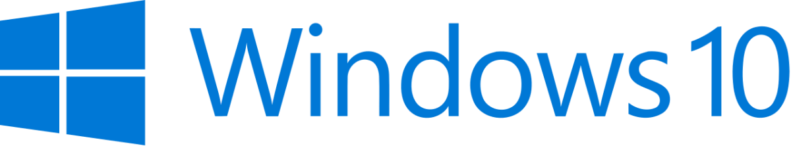

## Altijd en overal

Altijd en overal kunnen werken, anytime-anyplace-anywhere, en meer van dat soort kreten die in de loop van de jaren voorbij zijn gekomen. 
Ze komen allemaal op hetzelfde neer: Jou de flexibiliteit geven die je werkzaamheden nodig hebben. 
Voor de ene persoon kan dit zijn dat werkzaamheden vanuit huis uitgevoerd kunnen worden zoals op kantoor, voor de ander betekend het dat ze ten alle tijden bij hun email en data moeten kunnen... zelfs bij het tankstation.

De moderne werkplek is in staat om al deze scenarios te faciliteren en afhankelijk van je lokatie, internet verbinding en device jou toegang verschaft naar je data op een voor jou optimale manier. 
Uiteindelijk gaat het om de gebruikerservaring, en dat is wat er bij de moderne werkplek centraal staat... maar zonder in te leveren op security of compliance!

</img>
## Ieder device, elke locatie
Of je nu werkt op een tablet thuis, een laptop in een restaurant terwijl je wacht op je afspraak, of op een desktop op kantoor... een moderne werkplek geeft je de flexibiliteit om te werken waar, wanneer en hoe je dit wilt en op een manier die op dat moment het beste bij je past.

Om een paar voorbeelden te noemen:


<dl>
<b><u><i>Zakelijk</i></u></b>
<dt>Je werkt op een desktop/computer/laptop?</dt>
<dd>Dan zijn waarschijnlijk de applicaties geïnstalleerd.</dd>
<dt>Je werkt op een tablet?</dt>
<dd>Dan gebruik je de web-based Office365 producten, 
of de apps geïnstalleerd je tablet.</dd>
<dt>Je werkt op een telefoon?</dt>
<dd>Dan gerbruik je de apps geïnstalleerd op je telefoon.</dd>
</dl>
<---> <!-- separator between columns -->
<dl>
<b><u><i>Privé</i></u></b>
<dt>Je werkt op een privé desktop/computer of laptop?</dt>
<dd>Dan is het mogelijk de licenties van je werkgever te gebruiken, 
of je maakt gebruik van een remote-desktop
omgeving zoals Windows Virtual Desktop.</dd>
<dt>Je werkt op een privé tablet?</dt>
<dd>Dan gebruik je de web-based Office365 producten, of een remote-desktop 
omgeving zoals Windows Virtual Desktop
of de apps geïnstalleerd je tablet.</dd>
</dl>


Natuurlijk ben je niet gebonden aan een oplossing aan de hand van je device.
Als je op een zakelijke laptop werkt, dan kun je natuurlijk ook gebruik maken van de web-based Office 365 producten als dat is wat je lekker vind werken.
De moderne werkplek faciliteert jou om zo productief mogelijk te werken.

## Een betrouwbare werkplek
Door gebruik te maken van de nieuwste technologie stellen wij je in staat zorgeloos te werken en productief te zijn.
Van het beveiligen van je laptop en andere hardware, tot je identiteit en je data... wij configueren de system zodat jouw productiviteit er geen hinder aan ondervind, maar toch alles veilig is, en blijft.