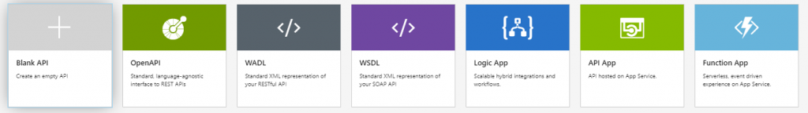

</img>
## Uniform API-beheer

De innovatieve ondernemingen van tegenwoordig stappen over op API-architecturen om de groei te versnellen. Stroomlijn uw werk in hybride omgevingen en omgevingen met voor veel clouds met één plek voor het beheer van al uw API's.

De moderne werkplek is in staat om al deze scenarios te faciliteren en afhankelijk van je lokatie, internet verbinding en device jou toegang verschaft naar je data op een voor jou optimale manier. 
Uiteindelijk gaat het om de gebruikerservaring, en dat is wat er bij de moderne werkplek centraal staat... maar zonder in te leveren op security of compliance!

## Security & Analytics
Azure API Management geeft je een eenvoudige manier om je API's te beveiligen tegen allerlei soorten aanvallen. Dit onder andere door middel van IP-filtering, maar ook cyphers, TLS levels, API sleutels, client certificaten en nog veel meer.
Natuurlijk wil je inzicht in het gebruik van je API's, wat door Azure API Management op een simplistische wijze wordt gegeven. Hierin is de informatie te vinden op onder andere vragen zoals hoe vaak een API is aangeroepen, welke specifieke operatie/actie wordt gebruikt en natuurlijk wie dit heet aangeroepen.

Samen vormen de drie bovenstaande onderdelen voor een goede API management inrichting, waarbij duidelijk is welke API door wie op een veilige aangeroepen kan worden. zodat misbruik kan worden tegengegaan.

## API Migraties
Migreren van je legacy SOAP API naar een REST API is nog nooit zo makkelijk geweest! Je importeerd je SOAP API binnen Azure API Management, geeft aan dat deze de API moet converteren naar REST, en er zal een REST API endpoint beschikbaar komen die is te benaderen voor de systemen die voortaan via een REST API met uw software willen communiceren.
Azure API Management zal dan vanaf dat punt alle API verzoeken van REST vertalen naar SOAP, en deze als SOAP verzoek doorsturen naar uw systeem. 

</img>

Tijd benodigd voor een SOAP naar REST API Migratie? *Uurtje ;-)*

## Voordelen
Enkele voordelen van Azure API Management zijn:
* Flexibele en naukeurige quota's kunnen ingesteld en afgedwongen worden.
* Beveilig je API's met sleutels, tokens en IP-filtering.
* Verificatie van API-sleutels, JWT-tokens, certificaten en andere referenties.
* Alleen valide API-aanroepen worden geaccepteerd en naar de API’s doorgestuurd.
* Houdt al je API's achter één statisch IP-adres of domein.
* Verbind on-premises API's met cloudservices en integreer op een veilige manier je (cloud)omgevingen.
* (automatisch) importeren van je bestaande API's door middel van hun schema's
* Werkt met open standaarden zoals WSDL, OpenAPI / Swagger, etc.
* Gebruiker en groep management.