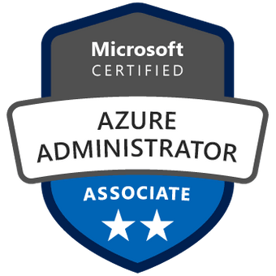

    

## Omschrijving
Deze cursus leert IT-professionals hun Azure-abonnementen te beheren, identiteiten te beveiligen, de infrastructuur te beheren, virtuele netwerken te configureren, Azure en on-premise sites te verbinden, netwerkverkeer te beheren, opslagoplossingen te implementeren, virtuele machines te maken en te schalen, web-apps en containers te implementeren, maken van een back-up van gegevens, data delen en het monitorenvan uw oplossing.

## Doelstellingen
Klaarstomen om te slagen voor het examen en het Microsoft Role-Based-certificaat Microsoft Ceritified Azure Administrator Associate te behalen.

## Doelgroep
Deze cursus is voor Azure-beheerders. De Azure-beheerder implementeert, beheert en bewaakt identiteit, beheer, opslag, rekenkracht en virtuele netwerken in een cloudomgeving. De Azure-beheerder zorgt voor de inrichting, grootte, bewaking en aanpassing van resources waar nodig.

## Voorkennis
Onderstaande voorkennis is vereist:

* Microsoft Azure Fundamentals (AZ-900) (2 dagen) of vergelijkbare kennis.
* Successful Azure Administrators start this role with experience on operating systems, virtualization, cloud infrastructure, storage structures, and networking.
* Understanding of on-premises virtualization technologies, including: VMs, virtual networking, and virtual hard disks.
* Understanding of network configuration, including TCP/IP, Domain Name System (DNS), virtual private networks (VPNs), firewalls, and encryption technologies.
* Understanding of Active Directory concepts, including domains, forests, domain controllers, replication, Kerberos protocol, and Lightweight Directory Access Protocol (LDAP).
* Understanding of resilience and disaster recovery, including backup and restore operations.

