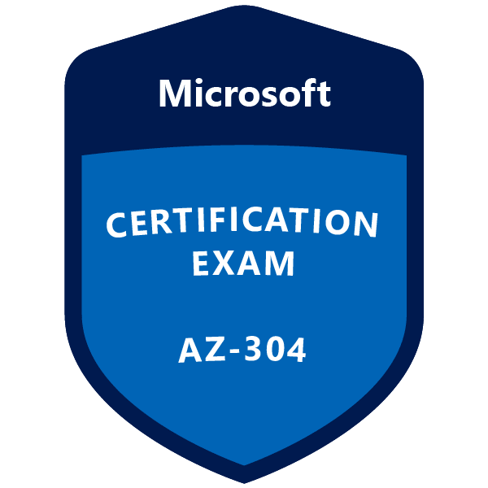

    

## Omschrijving
Deze cursus bereidt zich voor op de Azure Architect-rol en de Microsoft Certified: Azure Solutions Architect Associate-certificering. Kandidaten voor dit examen zijn Azure Solution Architects die belanghebbenden adviseren en zakelijke vereisten vertalen naar veilige, schaalbare en betrouwbare oplossingen. Kandidaten moeten over geavanceerde ervaring en kennis beschikken over verschillende aspecten van IT-operaties, waaronder netwerken, virtualisatie, identiteit, beveiliging, bedrijfscontinuïteit, disaster recovery, gegevensbeheer, budgettering en governance. Voor deze rol moet worden beheerd hoe beslissingen op elk gebied van invloed zijn op een algehele oplossing. Kandidaten moeten bekwaam zijn in Azure-beheer, Azure-ontwikkeling en DevOps, en vaardigheden op expertniveau hebben in ten minste een van deze domeinen.

## Doelstellingen
Klaarstomen om te slagen voor het examen en het Microsoft Role-Based-certificaat Microsoft Ceritified Azure Administrator Associate te behalen.

## Doelgroep
Kandidaten voor dit examen zijn Azure Solution Architects die belanghebbenden adviseren en zakelijke vereisten vertalen naar veilige, schaalbare en betrouwbare oplossingen.

Kandidaten moeten over geavanceerde ervaring en kennis beschikken over verschillende aspecten van IT-operaties, waaronder netwerken, virtualisatie, identiteit, beveiliging, bedrijfscontinuïteit, disaster recovery, gegevensbeheer, budgettering en governance. Voor deze rol moet worden beheerd hoe beslissingen op elk gebied van invloed zijn op een algehele oplossing.

Kandidaten moeten bekwaam zijn in Azure-beheer, Azure-ontwikkeling en DevOps, en vaardigheden op expertniveau hebben in ten minste een van deze domeinen.

## Voorkennis

* Inzicht in de implementatie en configuratie van cloudinfrastructuur
* Inzicht in het implementeren van workloads en beveiliging
* Basiskennis Cloud Architect Technology Solutions
* Inzicht in het maken en implementeren van apps
* Kennis van ontwikkelen voor de cloud

