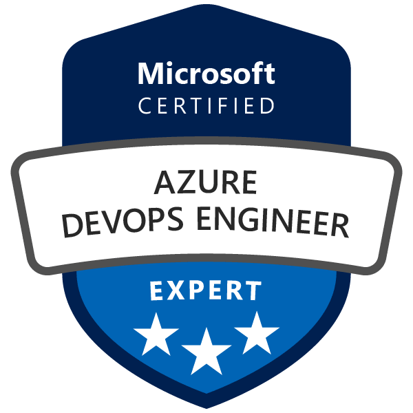

    

## Omschrijving
Deze cursus biedt de kennis en vaardigheden om DevOps-processen en -praktijken te ontwerpen en implementeren. Studenten leren plannen voor DevOps, bronbeheer gebruiken, Git schalen voor een onderneming, artefacten consolideren, een strategie voor afhankelijkheidsbeheer ontwerpen, geheimen beheren, continue integratie implementeren, een strategie voor het bouwen van containers implementeren, een releasestrategie ontwerpen, een release opzetten managementworkflow, implementeer een implementatiepatroon en optimaliseer feedbackmechanismen.

## Doelstellingen
* Klaarstomen om te slagen voor het examen en het Microsoft Role-Based-certificaat Microsoft Azure DevOps Solutions te behalen.
* Plan de transformatie met gedeelde doelen en tijdlijnen
* Selecteer een project en identificeer projectstatistieken en KPI's
* Creëer een team en een flexibele organisatiestructuur
* Beschrijf de voordelen van het gebruik van Source Control
* Migreer van TFVC naar Git en schaal Git voor Enterprise DevOps
* Beveel hulpmiddelen en werkwijzen voor artefactbeheer aan
* Vat veelgebruikte pakketten samen om delen en hergebruik mogelijk te maken
* Migreer en consolideer artefacten en integreer broncontrolemaatregelen
* Beheer applicatieconfiguratie en geheimen
* Ontwikkel een kwaliteitsstrategie voor het project
* Plan voor veilige ontwikkelingspraktijken en nalevingsregels
* Implementeer en beheer build-infrastructuur en leg uit waarom continue integratie belangrijk is
* Implementeer continue integratie met behulp van Azure DevOps
* Beheer de codekwaliteit, inclusief: technische schuld, SonarCloud en andere toolingoplossingen en beveiligingsbeleid met open source, OWASP en WhiteSource Bolt
* Implementeer een containerstrategie, inclusief hoe containers verschillen van virtuele machines en hoe microservices containers gebruiken
* Implementeer containers met Docker
* Inspecteer open source softwarepakketten voor beveiliging en licentienaleving om ze af te stemmen op de bedrijfsnormen
* Configureer de build-pijplijn om toegang te krijgen tot pakketbeveiliging en licentieclassificatie en om de toegang tot pakketfeeds te beveiligen
* Inspecteer de codebase om codeafhankelijkheden te identificeren die kunnen worden geconverteerd naar pakketten
* Identificeer en beveel gestandaardiseerde pakkettypen en -versies in de hele oplossing aan
* Herstructureer bestaande build-pijplijnen om een ​​versiestrategie te implementeren die pakketten publiceert
* Beheer beveiliging en compliance
* Maak onderscheid tussen een release en een implementatie en definieer de componenten van een release-pijplijn
* Leg dingen uit waarmee u rekening moet houden bij het ontwerpen van uw releasestrategie
* Classificeer een release- versus een releaseproces en geef aan hoe u de kwaliteit van beide kunt controleren
* Beschrijf het principe van release gates en hoe u omgaat met release notes en documentatie
* Leg inzetpatronen uit, zowel in traditionele zin als in moderne zin
* Kies een tool voor releasebeheer en leg de terminologie uit die wordt gebruikt in Azure DevOps en andere tooling voor releasebeheer
* Beschrijf wat een Build and Release-taak is, wat deze kan doen en enkele beschikbare implementatietaken
* Classificeer een agent, agentwachtrij en agentpool
* Leg uit waarom u soms meerdere releaseopdrachten in één release-pijplijn nodig hebt
* Maak onderscheid tussen vrijgavetaken met meerdere agents en met meerdere configuraties
* Gebruik releasevariabelen en fasevariabelen in uw releasepijplijn
* Implementeer veilig in een omgeving met behulp van een serviceverbinding
* Sluit testen in de pijplijn in
* Maak een lijst van de verschillende manieren om de status van uw pijplijn en release te inspecteren met behulp van waarschuwingen, service-hooks en rapporten
* Creëer een vrijgavepoort
* Beschrijf implementatiepatronen
* Implementeer Blue Green Deployment, Canary Release en Progressive Exposure Deployment
* Configureer crashrapportintegratie voor clienttoepassingen
* Ontwikkel monitoring- en statusdashboards
* Implementeer routing voor crashrapportgegevens van clienttoepassingen en tools om systeemgebruik, functiegebruik en stroom bij te houden
* Integreer en configureer ticketingsystemen met het werkbeheer van het ontwikkelteam
* Implementeer een mobiele DevOps-strategie
* Pas infrastructuur en configuratie toe als codeprincipes.
* Implementeer en beheer infrastructuur met behulp van automatiseringstechnologieën van Microsoft, zoals ARM-sjablonen, PowerShell en Azure CLI
* Beschrijf implementatiemodellen en services die beschikbaar zijn met Azure
* Implementeer en configureer een Managed Kubernetes-cluster en -infrastructuur met behulp van tools en services van derden met Azure, zoals Chef, Puppet, Ansible, SaltStack en Terraform
* Definieer een infrastructuur- en configuratiestrategie en een geschikte toolset voor een release-pijplijn en applicatie-infrastructuur
* Implementeer compliance en beveiliging in uw applicatie-infrastructuur
* Ontwerppraktijken om de tevredenheid van eindgebruikers te meten, processen om gebruikersfeedback van externe bronnen vast te leggen en te analyseren en routing voor crashrapportgegevens van clienttoepassingen

## Doelgroep
Studenten in deze cursus zijn geïnteresseerd in het implementeren van DevOps-processen of in het behalen van het Microsoft Azure DevOps Solutions-certificeringsexamen.

## Voorkennis
Onderstaande voorkennis is vereist:

* Fundamentele kennis over Azure, versiebeheer, Agile softwareontwikkeling en kernprincipes van softwareontwikkeling.
* Het zou handig zijn om ervaring te hebben in een organisatie die software levert.

